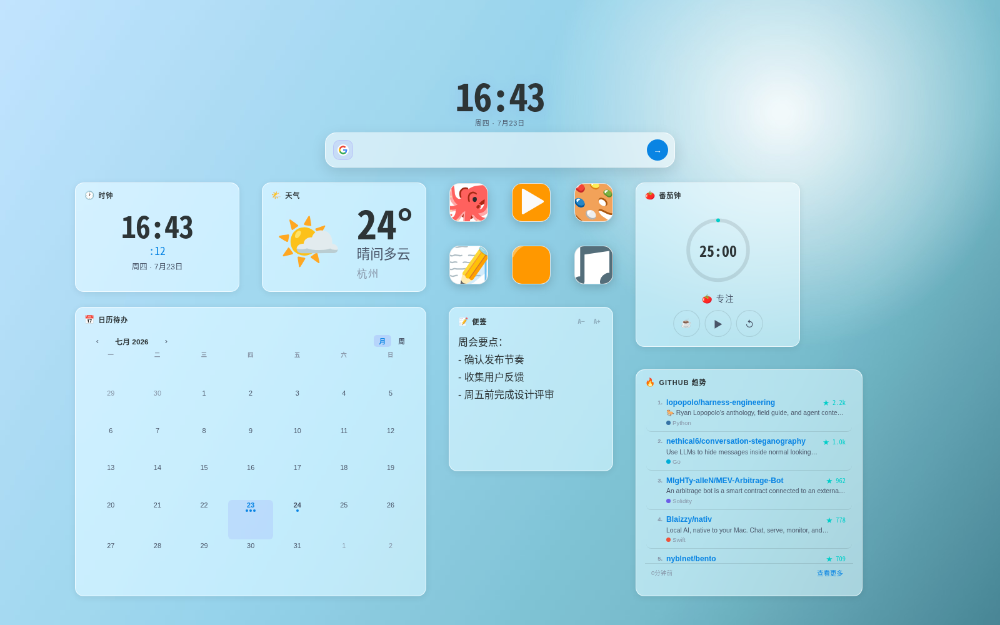
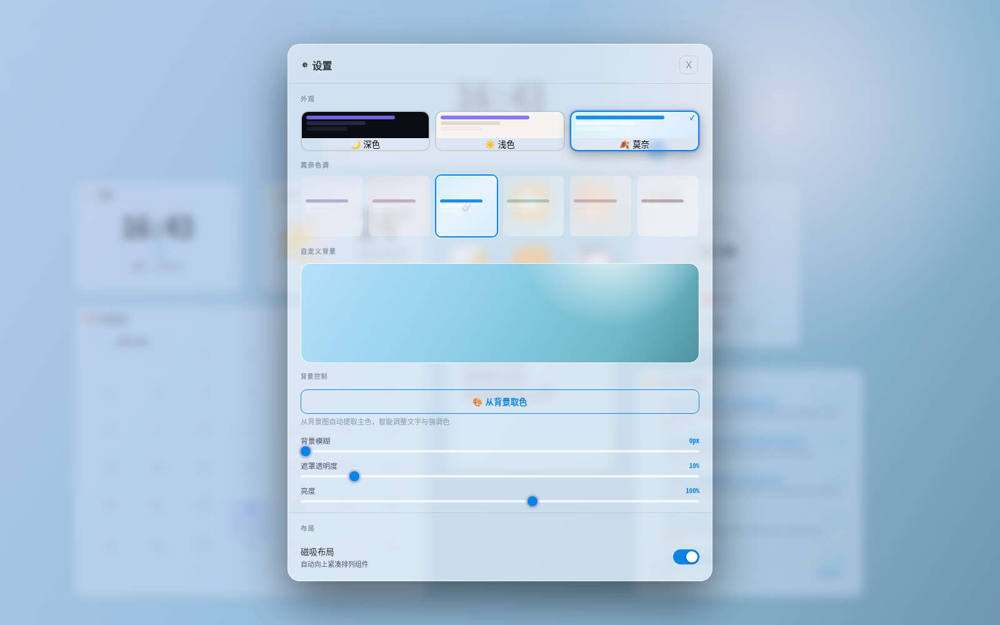
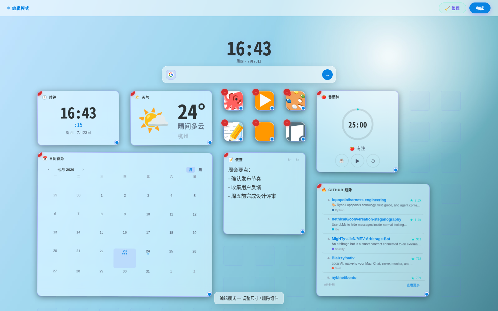
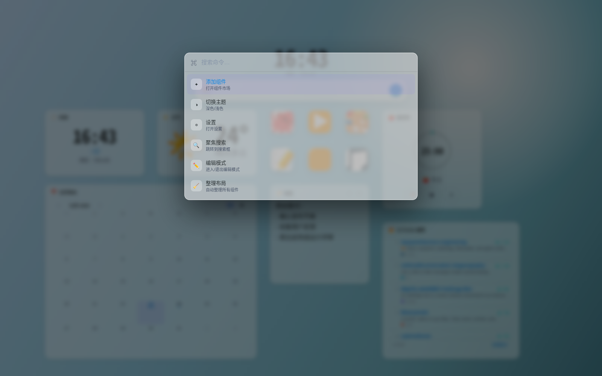

# Zen Tab

一个简洁、可高度自定义的浏览器新标签页仪表盘。纯原生 JS + CSS 实现，无构建工具、无框架依赖，以 Chrome 扩展（Manifest V3）形式运行。



---

## 功能特性

### 🧩 组件系统

自由组合以下 8 种组件，拖拽排列、随时增删：

| 组件 | 说明 |
|---|---|
| 🕐 时钟 | 实时时间与日期，随组件尺寸自动缩放字号 |
| 🔗 快捷链接 | 独立的图标式链接，支持自动抓取网站图标、Emoji 或自定义上传图片 |
| 📝 便签 | 本地文本便签，字号可调，自动保存 |
| 📅 日历待办 | 月视图 / 周视图切换，按日期管理任务，支持拖拽调整任务日期 |
| 🌤 天气 | 基于 Open-Meteo 的实时天气，自动定位城市，点击展开 7 天预报 |
| 🍅 番茄钟 | 专注计时器，时长可自定义，专注 / 休息模式一键切换 |
| 🔥 GitHub 趋势 | 每日热门仓库榜单，含语言、星标数，支持展开更多 |
| 🌐 网页嵌入 | 在 iframe 中嵌入任意网页 |

组件面板（`Ctrl+A`）里可以按分类筛选、搜索添加；每个组件右上角悬浮显示专属操作（比如便签的字号调节、链接的编辑按钮）。

### 🎨 主题与个性化

- **三套主题**：深色 / 浅色 / 莫奈（莫奈主题含薰衣草、玫瑰、海洋、丛林、陶土、沙丘 6 种色调）
- 主题切换带涟漪扩散动画，色彩变量平滑过渡
- **自定义背景**：上传任意图片作为背景，支持模糊、遮罩透明度、亮度调节
- **背景取色**：一键从背景图提取主色调（Canvas + K-means 聚类），自动生成匹配的强调色、文字色与卡片配色，让界面跟着背景图走

<p align="center"></p>

### 🖱 布局与交互

- 自由拖拽定位，组件之间自动避让、不会重叠
- 每个组件右下角一个手柄自由缩放，左上角一键删除（二次确认，防误删）
- 图标类组件（链接/番茄钟/天气/时钟）保持固定宽高比，不会被拉变形
- 磁吸布局：开启后自动向上紧凑排列，也可以关闭做自由摆放
- 长按空白区域或组件进入编辑模式，一键"整理布局"
- 右键组件：编辑、复制链接、移到最前、删除
- 纯净模式：隐藏所有组件，只保留时钟与搜索框，专注当下

<p align="center"></p>

### ⌨️ 命令面板与快捷键

`Ctrl+K` 呼出命令面板，模糊搜索所有操作——添加组件、切换主题、进入编辑模式、整理布局……不用鼠标也能掌控整个仪表盘。

<p align="center"></p>

### 🔍 搜索与语言

- 搜索框支持 Google / Bing / DuckDuckGo / 百度，`Tab` 键快速轮换引擎
- 中文 / English 双语界面，实时切换，无需刷新

---

## 快捷键

| 快捷键 | 功能 |
|---|---|
| `Ctrl+K` | 打开命令面板 |
| `Ctrl+A` | 打开组件库 |
| `Ctrl+M` | 切换主题 |
| `Ctrl+E` | 进入 / 退出编辑模式 |
| `Ctrl+P` | 进入 / 退出纯净模式 |
| `/` | 聚焦搜索框 |
| `Esc` | 关闭当前面板 / 退出模式 |
| `Tab`（搜索框内） | 切换搜索引擎 |

---

## 安装方式

### 开发者模式安装（推荐）

1. 克隆或下载本仓库
   ```bash
   git clone https://github.com/Coveduoji/zen-tab.git
   ```
2. 打开 Chrome，地址栏访问 `chrome://extensions`
3. 右上角开启 **开发者模式**
4. 点击 **加载已解压的扩展程序**，选择项目根目录
5. 打开新标签页即可使用

> **注意**：`icons/` 目录下需要放入扩展图标文件，具体规格以 `manifest.json` 的 `icons` 字段为准。

---

## 项目结构

```
zen-tab/
├── manifest.json          # Chrome 扩展清单（Manifest V3）
├── newtab.html             # 新标签页入口
├── style.css                # 全局样式
├── icons/                    # 扩展图标
├── screenshots/          # README 截图
│
└── js/
    ├── registry.js        # 组件注册表与目录（REG / CATALOG）
    ├── i18n.js             # 国际化（中 / 英双语）
    ├── utils.js            # 工具函数（esc / normalizeUrl / genId / 图片压缩等）
    ├── layout.js           # 布局引擎（碰撞检测 / 紧凑排列 / 宽高比锁定 / Timer 注册表）
    ├── state.js            # 状态管理（loadState / saveState）
    ├── theme.js            # 主题系统（切换动画 / 背景 / 调色板提取）
    ├── main.js              # 入口，串联初始化流程
    │
    ├── ui/
    │   ├── toast.js         # 通知与确认弹窗
    │   ├── search.js       # 搜索引擎切换器
    │   ├── editmode.js   # 编辑模式与网格背景
    │   ├── render.js       # 组件渲染、拖拽、缩放
    │   ├── linkmodal.js  # 链接编辑弹窗
    │   ├── cmdpalette.js # 命令面板
    │   ├── puremode.js   # 纯净模式
    │   ├── settings.js    # 设置面板与组件库
    │   └── panels.js       # FAB / 右键菜单 / 快捷键 / 顶部时钟
    │
    └── widgets/
        ├── clock.js
        ├── link.js
        ├── notes.js
        ├── todo.js
        ├── weather.js
        ├── pomodoro.js
        ├── embed.js
        └── gtrend.js
```

---

## 数据存储

所有数据存储在浏览器 `localStorage` 中：

| Key | 内容 |
|---|---|
| `dash_v3` | 主状态（组件布局 + 设置），大图片替换为占位符 |
| `dash_bg_img` | 背景图片 base64（单独存储，原图质量不压缩） |
| `dash_limg_<id>` | 链接组件自定义图标 base64（上传时自动压缩到 400px 以内） |
| `cal_tasks_v1` | 日历待办的任务数据，跨所有日历组件实例共享 |
| `weather_cache_v2` / `gtrend_cache_v2` | 天气 / GitHub 趋势的接口响应缓存（10 分钟过期） |

存储版本号为 `3`，数据结构变更时会自动迁移而不丢失用户数据；容量超限时会给出提示并做降级保存，不会导致数据完全丢失。

---

## 技术说明

- 纯原生 JS + CSS，无构建工具，无框架依赖
- 布局引擎自研：整数网格 + AABB 碰撞检测，列数随窗口宽度动态计算（不是固定列数），组件永远不会被挤到看不见的地方
- 拖拽 / 缩放全程 `requestAnimationFrame` 节流，几何量按交互会话缓存，避免逐帧强制回流
- 用 `ResizeObserver` 监听画布容器尺寸变化（而非仅监听 `window.resize`），页面缩放、窗口拖动都能正确响应
- 主题切换使用 CSS `@property` 注册颜色变量，配合 View Transitions API 实现涟漪扩散过渡
- 背景取色使用 Canvas + K-means 聚类算法（k=6）提取主色调，自动适配深浅色文字对比度
- 遵循 Manifest V3 CSP，所有脚本本地加载

---

## License

MIT
